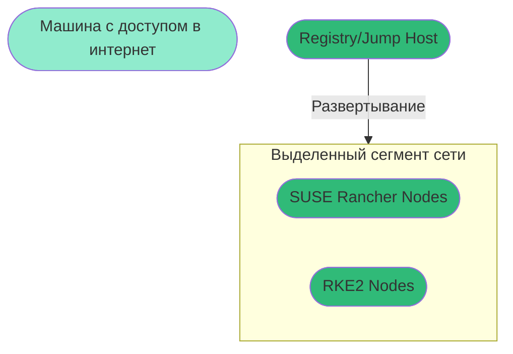





# airgap-10.2022
Материалы к вебинару установки SUSE Rancher Airgap

```mermaid
flowchart TB
style id1 fill:#90EBCD
style id2 fill:#30BA78
style id3 fill:#30BA78
style id4 fill:#30BA78

  id1([Машина с доступом в интернет])
  id2(["Registry/Jump Host"])
  id2 --> |Развертывание| d30
  subgraph d30 ["Выделенный сегмент сети"]
    id3([SUSE Rancher Nodes])
    id4([RKE2 Nodes])
  end
```

[Файлы материалов](https://github.com/ppzhukov/airgap-10.2022/)

