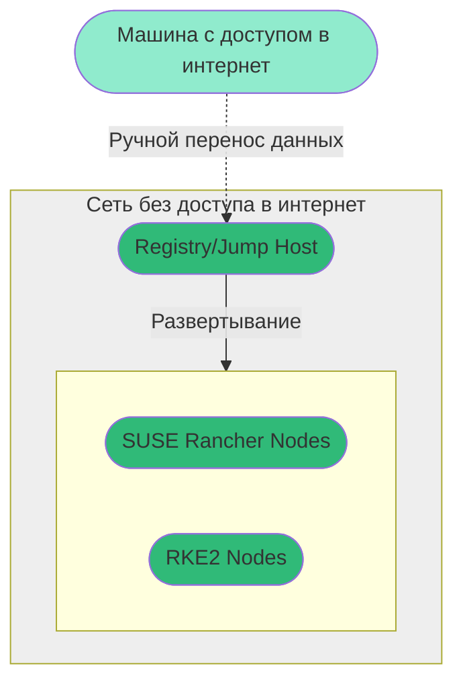

# airgap-10.2022
Материалы к вебинару установки SUSE Rancher Airgap
## Системные требования
Для установки RKE/RKE2/K3S и Rancher в инфраструктуре с воздушным зазором нам потребуется:
1. Выделенная машина с доступом в интернет, которая скачает все необходимые для установки данные.
2. Сервер Registry внутри безопасного контура на котором разместятся данные требуемые для развертывание инфраструктуры.
3. Jump Host с помощью которого мы будем управлять развертываемыми серверами.
4. Хосты на которые мы будем производить установку.

рис.1 Архитектура решения

В тестовом варианте мы можем совместить ряд ролей (Например Registry и Jump Host, роли серверов Kubernetes)
В нашем вебинаре мы будем использовать следующий стек продуктов и роли.
1. Сервер с доступом в интернет на базе SUSE Linux Enterprise Server.
2. Данный пример использует в качестве среды виртуализации VMware vSphere, но Вы можете использовать любую другую, создав необходимый шаблон виртуальной машины и подключив нужные модули в Rancher, если требуется его интеграция.
3. Template для узлов в VMware vSphere (который мы создадим чуть позже), а также преднастроенные узлы и сетевой сегмент для развертывание.  
4. Jump Host, с помощью которого будет производиться настройка узлов сети и на котором будет размещен Docker Registry
5. В Вашей обособленной сети должна быть доступна служба DNS, если ее нет, Вы можете для тестов воспользоваться [sslip.io](https://github.com/cunnie/sslip.io) для реализации простого DNS доступа.
6. В Вашей обособленной сети должен быть настроен DHCP. Вы можете использовать только статические адреса для Ваших стендов, но тема интеграции VMware vSphere с SUSE Rancher для использования только статических адресов и автоматического развертывания кластеров RKE выходит за рамки этого вебинара, но если она Вам интересна некоторый пример и ссылку на описание как это сделать Вы можете найти [здесь](https://github.com/dff1980/2020.2-PoC/blob/cc490da8b3d55404004b3e22eda80c3c67a7f3d9/vApp/readme.md#using-a-pool-of-addresses-in-vapp-in-the-sphere).
7. В Вашей обособленной сети должна быть настроена служба синхронизации времени NTP. (например Chrony)
8. Узел для развертывания Rancher (В отказоустойчивой конфигурации Вам потребуются 3 узла, но для демонстрации концепции достаточно одного).
9. Три узла для развертывания управляемого кластера (будут созданы Racnher, донастроены cloud-init).

### Аппаратные требования
- 1x Front Server
  2 vCPU
  4 GiB RAM
  1 x HDD 300GB 

- 1x Jump Host
  2 vCPU
  4 GiB RAM
  1 x HDD 300GB (для registry)
  Поскольку мы совместили роли, нам понадобиться больше места: хранить копию данных образов для загрузки, копию данных образов в Docker, копию данных образов в Registry.

- 1x dedicate server for Rancher
  4 vCPU
  16 GiB RAM
  1 x HDD 100 GB

- 3x RKE2 Node - role: ETCD, Controls Plane, Worker
  16 vCPU
  64 GiB RAM
  1 x HDD 320 GB
  Поскольку мы совместили роли, нам понадобиться больше ресурсов для запуска реальной нагрузки.

### Используемые версии
- SUSE RKE2 v1.24.6+rke2r1 (Версия Kubernetes 1.24 для SUSE Rancher v2.6.8
- SUSE Rancher v2.6.8
- SUSE SLES 15 SP4
- Helm v3.9.4 (Поддерживаемые версии Kubernetes 1.24.x - 1.21.x)
- Сert Manager v1.7.1
- SUSE Longhorn v1.2

## Установка и настройка сервера с доступом в интернет
На данном сервере Вам потребуется Linux с установленным Docker. Я рекомендую установить SUSE Linux Enterprise Server в базовой конфигурации (Это может быть вариант Minimal для которого можно использовать следующую [инструкцию](front_server-install_script.md), но потребуется действующая подписка (ключ активации) для онлайн установки ряда пакетов).
Вы можете установить все обновления SUSE Linux Enterprise Server, для этого Вам потребуется ключ активации, возможно также использование триального ключа.
Для тестирования на всех системах я рекомендую использовать один раздел root без разбиения.
1. Установить и запустить Docker
  - Если у Вас есть ключ активации и система активирована выполните следующую команду:
```bash
sudo SUSEConnect -p sle-module-containers/15.4/x86_64
```
Или
  - Если Вы установили SLES с DVD без подключения источников обновления и дополнительных модулей, то оставьте DVD в приводе (Важно, Вам нужен full ISO):
```bash
sudo yast2 add-on
```
  Выберите Add => DVD => Подключите DVD образ => Отметьте "Containers Module" и "Server Applications Module" => Next => Accept => OK => Finish => OK
  
  
 [](https://asciinema.org/a/PhQlui3Vy3xYhg9FOuDofPWnY?autoplay=1)

Для установки docker выполните:
```bash
sudo zypper in -y docker
sudo usermod -aG docker root
sudo systemctl enable --now docker
sudo chown root:docker /var/run/docker.sock
```
2. Установка CLI helm
```bash
curl -fsSL -o get_helm.sh https://raw.githubusercontent.com/helm/helm/main/scripts/get-helm-3
chmod 700 get_helm.sh
sudo ./get_helm.sh -v v3.9.4
```
3. Найдите и скачайте файлы требуемой версии Rancher
Перейдите страницу с данными [releases](https://github.com/rancher/rancher/releases) и найдите релиз v2.x.x версии которой хотите установить и нажмите Assets. Примечание. Не используйте выпуски с пометкой *rc* или *Pre-release*, так как они нестабильны и не для производственной среды.
Скачайте из секции Assets следующие файлы (они требуются для установки в окружение с воздушным зазором):
- __rancher-images.txt__  Этот файл содержит список образов требуемых для установки Rancher, развертывания коастера и использования инструментов (tools) Rancher.
- __rancher-save-images.sh__	Этот скрипт скачает (pulls) все образы из rancher-images.txt с Docker Hub и сохранит их как rancher-images.tar.gz
- __rancher-load-images.sh__	Этот скрипт загрузит (loads) образы из rancher-images.tar.gz и выгрузит (pushes) в частное (private) registry.

В данном вебинаре мы используем:
```bash
wget https://github.com/rancher/rancher/releases/download/v2.6.8/rancher-images.txt
wget https://github.com/rancher/rancher/releases/download/v2.6.8/rancher-save-images.sh
wget https://github.com/rancher/rancher/releases/download/v2.6.8/rancher-load-images.sh
```


4. Получите список образов cert-manager (менеджер сертификатов)
При установке Kubernetes если Вы выберете использование самоподписные сертификаты (default self-signed TLS certificates) Вам требуется добавить список образов в файл __rancher-images.txt__.
  1. Получите latest cert-manager helm chart и выгрузите из шаблона информацию об образах:
```bash
helm repo add jetstack https://charts.jetstack.io
helm repo update
helm fetch jetstack/cert-manager --version v1.7.1
helm template ./cert-manager-v1.7.1.tgz | awk '$1 ~ /image:/ {print $2}' | sed s/\"//g >> ./rancher-images.txt
``` 
  2. Отсортируйте список и оставьте только уникальные записи:
```bash
sort -u rancher-images.txt -o rancher-images.txt
```
5. Получите список образов RKE2
  1. Перейдите на страницу [releases page](https://github.com/rancher/rke2/releases), Найдите RKE2 release который планируете установить и нажмите Assets.
В секции Assets скачайте следующий файл со списком образов, требуемых для установки RKE2 в инфраструктуре с воздушным зазором:
 __rke2-images-all.linux-amd64.txt__

  2. Добавьте образы RKE2 к файлу __rancher-images.txt__:
```bash
wget https://github.com/rancher/rke2/releases/download/v1.24.6%2Brke2r1/rke2-images-all.linux-amd64.txt
sed -i 's/docker\.io\///' rke2-images-all.linux-amd64.txt
cat rke2-images-all.linux-amd64.txt >> ./rancher-images.txt
```
  3. Отсортируйте и оставьте только уникальные записи:
```bash
sort -u rancher-images.txt -o rancher-images.txt
```
6. Сохраните образы на Вашу рабочую станцию
  1. сделайте __rancher-save-images.sh__ исполняемым:
```bash
chmod +x rancher-save-images.sh
```
  2. Запустите __rancher-save-images.sh__ используя список образов __rancher-images.txt__ image для создания tarball:
```bash
sudo ./rancher-save-images.sh --image-list ./rancher-images.txt
```
Результат: Docker начнет извлекать (pulling) образы для установки с воздушным зазором. Будьте терпеливы. Этот процесс займет какое-то время. Когда процесс завершить будет сформирован файл __rancher-images.tar.gz__.

7. Добавьте репозиторий Rancher Helm Chart

```bash
helm repo add rancher-stable https://releases.rancher.com/server-charts/stable
helm fetch rancher-stable/rancher --version=v2.6.8
```

8. Получите render шаблона cert-manager (замените 192.168.0.10.sslip.io:5000 - на адрес вашего будущего registry, можете использовать для этого Jump Host)

```bash
export registry_url=192.168.0.10.sslip.io:5000
helm template cert-manager ./cert-manager-v1.7.1.tgz --output-dir . \
    --namespace cert-manager \
    --set image.repository=${registry_url}/quay.io/jetstack/cert-manager-controller \
    --set webhook.image.repository=${registry_url}/quay.io/jetstack/cert-manager-webhook \
    --set cainjector.image.repository=${registry_url}/quay.io/jetstack/cert-manager-cainjector \
    --set startupapicheck.image.repository=${registry_url}/quay.io/jetstack/cert-manager-ctl
```
9. Скачайте cert-manager CRD

```bash
curl -L -o cert-manager/cert-manager-crd.yaml https://github.com/jetstack/cert-manager/releases/download/v1.7.1/cert-manager.crds.yaml
```

10. Получите render шаблона Rancher
Вы можете использовать как самоподписные, так и собственные сертификаты для установки Rancher, ниже пример для самоподписных сертификатов.
Ниже в переменной __rancher_fqdn__ Вы должны указать FQDN для будущего сервера Rancher. А в переменной __registry_url__ URL вашего registry в безопасном сегменте (как например адрес и порт используемых в данной инструкции Jump Host, если у Вас нет готового registry)
_опция --set replicas=1 указывает развернуть сервер Rancher с одной репликой, измените значения на 3 для отказоустойчивой архитектуры_
```bash
export rancher_fqdn=192.168.0.11.sslip.io
export registry_url=192.168.0.10.sslip.io:5000
helm template rancher ./rancher-2.6.8.tgz --output-dir . \
    --no-hooks \
    --namespace cattle-system \
    --set hostname=${rancher_fqdn} \
    --set certmanager.version=1.7.1 \
    --set rancherImage=${registry_url}/rancher/rancher \
    --set systemDefaultRegistry=${registry_url} \
    --set replicas=1 \
    --set useBundledSystemChart=true \
    --version=2.6.8
```
11. Скачайте утилиты CLI 
```bash
curl -LO https://storage.googleapis.com/kubernetes-release/release/`curl -s https://storage.googleapis.com/kubernetes-release/release/stable.txt`/bin/linux/amd64/kubectl
wget https://github.com/rancher/rke2/releases/download/v1.24.6%2Brke2r1/rke2.linux-amd64.tar.gz
```

12. Получите образы registry
```bash
 sudo docker pull httpd:2
 sudo docker save httpd:2 |  gzip --stdout > httpd.gz
 sudo docker pull registry:2
 sudo docker save registry:2 |  gzip --stdout > registry.gz
```

13. Скачайте с сайта [suse.com](https://suse.com) образ SLES 15 SP4 full ISO (SLE-15-SP4-Full-x86_64-GM-Media1.iso)
Для этого не требуется ключ активации, только регистрация на сайте.

14. Сделайте копию всех полученных данных на внешний носитель, для копирования в сегмент без доступа в интернет:
- rancher-load-images.sh
- rancher-images.tar.gz
- rancher-images.txt
- ./rancher
- ./cert-manager
- kubectl
- rke2.linux-amd64.tar.gz
- httpd.gz
- registry.gz
- SLE-15-SP4-Full-x86_64-GM-Media1.iso
Также для Вашего удобства к проекту приложено несколько файлов, которые пригодятся для создания стенда:
- [kiwi](kiwi)
- [certs.sh](certs.sh)

## Установка и настройка систем в изолированном контуре (Jump Host)
### Подготовка
- Скачайте установочный образ SUSE Linux Enterprise Server 15 SP4 (full ISO)
- Установите на Jump Host SUSE Linux Enterprise Server (оставьте подключенным к нему iso образ).
- Настройте firewall если планируете использовать на Jump Host Registry или деактивируйте firewall.
- Если у Вас доступен сервис RMT при установке добавьте следующие модули:
  - Containers Module
  - Server Applications Module
  - Development Tools Module

Перечисленные ниже команды исходят из того, что у Вас нет доступа к службе SUSE RMT (централизованного обновления) внутри изолированного сегмента. Если у Вас есть служба RMT, просто замените команды подключения репозиториев аналогичными с использованием SUSEConnect. Централизованное обновление выходит за рамки данного вебинара, но наличие этой службы во многом упростит работы.

Копируйте Ваши данные, полученные на сервере подключенном к интернет на Ваш Jump Host.

### Создания образа SLES для VMware vSphere
1. На Jump Host установите пакет kiwi.
Если Вы установили SLES с DVD без подключения источников обновления и дополнительных модулей, то оставьте DVD в приводе (Важно, Вам нужен full ISO):
```bash
sudo yast2 add-on
```
  Выберите Add => DVD => Подключите DVD образ => Отметьте "Development Tools Module" => Next => Accept => OK => Finish => OK
```bash
sudo zypper install -y python3-kiwi
sudo zypper install -y kiwi-templates-Minimal
```
2. Скопируйте каталог с настройками образа.
```bash
cp -r /usr/share/kiwi/image/suse-SLE15-Enterprise-Minimal ~/kiwi-SLES-template
```
3. Замените в каталоге ~/kiwi-SLES-template/config.sh на файл [config.sh](kiwi/config.sh)
4. Замените шаблон ~/kiwi-SLES-template/Minimal.kiwi на файл [Minimal.kiwi](kiwi/Minimal.kiwi) и измените пароль в готовом шаблоне получив его используя команду:
```bash
openssl passwd -1 -salt '{Примесь для пароля}' {Ваш пароль}
```
пример:
```bash
openssl passwd -1 -salt 'suse' suse1234
```
в разделе:
```
  <users group="root">
      <user password="$1$suse$8xZqp834AVBxSB.CQ0IEf." home="/root" name="root"/>
  </users>
```
5. Скачайте, если не сделали этого раньше, SUSE Linux Enterprise Server 15SP4 (full iso) SLE-15-SP4-Full-x86_64-GM-Media1.iso
6. Создайте каталог __/media/suse__
```bash
sudo mkdir -p /media/suse
```
7. Подключите iso к каталогу.
```bash
sudo mount SLE-15-SP4-Full-x86_64-GM-Media1.iso /media/suse/
```
8. Запустите следующую команду, чтобы создать образ:
```bash
sudo kiwi-ng  --profile VMware system build --description ./kiwi-SLES-template/ --target-dir /tmp/out
```
Сохраните получившейся файл __SLES15-SP4-Minimal-RKE2.x86_64-15.4.0.vmdk__

9. Получившийся образ диска загрузить в хранилище VMware vSphere и использовать его для создание виртуальной машины используемой в дальнейшем как шаблон при развертывании узлов Rancher и RKE2.

### Установите и настройте Docker
Если Вы установили SLES с DVD без подключения источников обновления и дополнительных модулей, то оставьте DVD в приводе (Важно, Вам нужен full ISO):
```bash
sudo yast2 add-on
```
  Выберите Add => DVD => Подключите DVD образ => Отметьте "Containers Module" => Next => Accept => OK => Finish => OK
 
Для установки docker выполните:
```bash
sudo zypper in -y docker
sudo usermod -aG docker root
sudo systemctl enable --now docker
sudo chown root:docker /var/run/docker.sock
```
### Установка и настройка локального Registry (Jump Host)
В данном примере мы создадим собственное Registry для размещения образов, но Вы можете воспользоваться любым подходящим используемым Вами решением.
_Если Вы настраиваете Registry на своем Jump Host убедитесь, пожалуйста, что у Вас открыты порты 8443 и 5000 в Вашем firewall или деактивируйте его_
#### Создание сертификатов для Registry
В этом проекте приложен [скрипт](certs.sh) для создания сертификатов для Registry.
Что-бы создать сертификаты выполните:
```bash
sudo zypper in -y gnutls
sudo mkdir -p /opt/certificates
```
Скопируйте [certs.sh](certs.sh) в /opt/certificates
В команде ниже замените FQDN и IP своими данными
```bash
cd /opt/certificates
sudo chmod +x certs.sh
sudo ./certs.sh --registry_fqdn 192.168.0.10.sslip.io --registry_ip 192.168.0.10
cd ..
```
Нам понадобиться добавить созданный сертификат CA в доверенные для Docker для этого:
- Установите утилиту jq
```bash
sudo zypper in -y jq
```
Поменяйте FQDN Registry (в примере __192.168.0.10.sslip.io__) на Ваши данные, используемые при создании сертификата и выполните (в примере, действия выполненны от учетной записи __root__):

```bash
su -
export registry_fqdn=192.168.0.10.sslip.io
export registry_url="https://${registry_fqdn}:8443"
echo "$(jq --arg urlarg "${registry_url}" '. += {"registry-mirrors": [$urlarg]}' /etc/docker/daemon.json)" > /etc/docker/daemon.json

cd /opt/certificates
mkdir -p /etc/docker/certs.d/${registry_url}
cp ${registry_fqdn}.cert ${registry_fqdn}.key ca.crt /etc/docker/certs.d/${registry_url}
cd ..

systemctl restart docker
```
#### Развертывание Registry
Копируйте с внешнего носителя файлы:
- httpd.gz
- registry.gz

Выполните следующие команды:
```bash
sudo docker load --input httpd.gz
sudo docker load --input registry.gz
sudo mkdir -p /opt/docker-certs
sudo mkdir -p /opt/docker-auth
sudo mkdir -p /opt/registry

cd /opt/certificates/
sudo cp registry.key.pem /opt/docker-certs/tls.key
sudo openssl x509 -inform PEM -in registry.cert.pem -out /opt/docker-certs/tls.crt
```

Создайте пароль для доступа к Registry (Замените имя пользователя __geeko__ и пароль __P@ssw0rd__ на Ваши данные):
```bash
sudo sh -c 'docker run \
 --entrypoint htpasswd \
 httpd:2 -Bbn geeko P@ssw0rd > /opt/docker-auth/htpasswd'
```

Для запуска контейнеров выполните команды ниже.

Мы запускаем два образа Registry использующих одну и туже общую папку (Один в режиме только для чтения) чтобы обеспечить работу как по паролю так и анонимного доступа.

```bash
sudo docker run -d \
  --restart=always \
  --name registry \
  -v /opt/docker-certs:/certs:ro \
  -v /opt/docker-auth:/auth:ro \
  -v /opt/registry:/var/lib/registry \
  -e "REGISTRY_AUTH=htpasswd" \
  -e "REGISTRY_AUTH_HTPASSWD_REALM=Registry Realm" \
  -e "REGISTRY_AUTH_HTPASSWD_PATH=/auth/htpasswd" \
  -e "REGISTRY_HTTP_ADDR=0.0.0.0:8443" \
  -e "REGISTRY_HTTP_TLS_CERTIFICATE=/certs/tls.crt" \
  -e "REGISTRY_HTTP_TLS_KEY=/certs/tls.key" \
  -e "REGISTRY_STORAGE_FILESYSTEM_ROOTDIRECTORY=/var/lib/registry" \
  -p 8443:8443 \
  registry:2

sudo docker run -d \
  --restart=always \
  --name registry-anonymous \
  -v /opt/docker-certs:/certs:ro \
  -v /opt/docker-auth:/auth:ro \
  -v /opt/registry:/var/lib/registry:ro \
  -e "REGISTRY_HTTP_TLS_CERTIFICATE=/certs/tls.crt" \
  -e "REGISTRY_HTTP_TLS_KEY=/certs/tls.key" \
  -e "REGISTRY_STORAGE_FILESYSTEM_ROOTDIRECTORY=/var/lib/registry" \
  -p 5000:5000 \
  registry:2
```

### Импортирование данных в локальный Registry
Скопируйте подготовленные Вами на внешнем носителе данные на Jump Host. На потребуются:
- rancher-load-images.sh
- rancher-images.tar.gz
- rancher-images.txt
- ./rancher
- ./cert-manager
- kubectl
- rke2.linux-amd64.tar.gz

Установите kubectl:
```bash
sudo cp kubectl /usr/local/bin/
sudo chmod +x /usr/local/bin/kubectl
```
Что-бы выгрузить образы поменяйте FQDN Registry (в примере __192.168.0.10.sslip.io__) на Ваши данные используемые при создании сертификата и выполните:

```bash
export registry_fqdn=192.168.0.10.sslip.io
export registry_url="https://${registry_fqdn}:8443"

sudo docker login ${registry_url}

chmod +x rancher-load-images.sh
sudo ./rancher-load-images.sh -l rancher-images.txt -r ${registry_fqdn}:8443
```
В результате должен получиться функционирующий Registry c образами, требуемыми для установки с воздушным зазором. Последняя команда выполняется продолжительное время.

### Развертывание SUSE Rancher
Для первоначальной настройки и установки SUSE Rancher потребуется:
- Развернуть 1 или 3 (для отказоустойчивости) виртуальные машины с Linux.
- Установить на него (них) RKE2 (Kubernetes)
- Развернуть Cert Manager
- Развернуть SUSE Rancher

#### Установка Linux на Ваш сервер SUSE Rancher
1. Использую получившийся шаблон разверните виртуальную машину.
В данном руководстве мы используем 1 сервер для Rancher.
Не забудьте указать правильный размер ресурсов, увеличить предоставляемый жесткий диск и т.д.
2. Настройте на Вашем сервере сеть в соответствии с выбранным IP адресом и именем заданным при __получении render шаблона Rancher__.
```bash
yast2 lan
```
3. Настройте на Вашем сервере службу синхронизации времени (например chrony).
```bash
yast2 ntp-client
```
#### Установка __RKE2__ на Ваш сервер SUSE Rancher
1. Копируйте (__rke2.linux-amd64.tar.gz__) на Ваш сервер Rancher и разархивируйте утилиту __rke2__ в папку __/usr/local/bin/__ .
_В примерах здесь и далее в качестве адреса сервера SUSE Rancher используется адрес 192.168.0.11_
На Jump Host выполните:
```bash
scp rke2.linux-amd64.tar.gz root@192.168.0.11:/tmp/
```
Зайдите на консоль сервера SUSE Rancher и выполните:
```bash
tar xzf "/tmp/rke2.linux-amd64.tar.gz" -C "/usr/local"
```
2. Сделайте доверенным сертификат Вашего сервера Registry.
Копируйте файл __/opt/certificates/cacert.pem__ с Jump Host на сервер SUSE Rancher:
```bash
scp /opt/certificates/cacert.pem root@192.168.0.11:/etc/pki/trust/anchors/rancher-stend.pem
```
Зайдите на консоль сервера SUSE Rancher и выполните:
```bash
update-ca-certificates && c_rehash
```
3. Настройте используемый по умолчанию Registry
Зайдите на консоль сервера SUSE Rancher и выполните (заменив на адрес Вашего Registry):
```bash
export registry_fqdn=192.168.0.10.sslip.io
export registry_uri="${registry_fqdn}:5000"
mkdir -p /etc/rancher/rke2
echo 'system-default-registry: "'${registry_uri}'"' > /etc/rancher/rke2/config.yaml
```
4. Загрузите __RKE2__
```bash
systemctl enable rke2-server --now
```
#### Установка SUSE Rancher
_В примерах ниже замените адрес 192.168.0.11 на адрес Вашего сервера Rancher._
Скопируйте файл конфигурации kubectl на Ваш Jump Host
```bash
scp root@192.168.0.11:/etc/rancher/rke2/rke2.yaml kubeconfig-rancher.yaml
```
Замените в нем адрес подключения с __127.0.0.1__ на __192.168.0.11__
```bash
sed -i 's/127.0.0.1/192.168.0.11/' ./kubeconfig-rancher.yaml
```
##### Установите __Cert Manager__
Для этого Выполните следующие команды:
Укажите где брать настройки kubectl
```bash
export KUBECONFIG=~/kubeconfig-rancher.yaml
```
Дождитесь старта Kuberntes, проконтролировать можно, например, командой:
```bash
kubectl get nodes
```
Создайте __Name Space__
```bash
kubectl create namespace cert-manager
```
Перейдите в папку с данными, скопированными с внешнего носителя и установите __Cert Manager__
```bash
kubectl apply -f cert-manager/cert-manager-crd.yaml
kubectl apply -R -f ./cert-manager
```
##### Установите Racnher
Укажите где брать настройки kubectl
```bash
export KUBECONFIG=~/kubeconfig-rancher.yaml
```
Перейдите в папку с данными скопированными с внешнего носителя и выполните:
```bash
kubectl create namespace cattle-system
kubectl -n cattle-system apply -R -f ./rancher
```

_Результат: у Вас получится установить RKE2 (Kubernetes) и установить в него SUSE Rancher используя локальный Registry и без подключения к интернет_

### Развертывание Kubernetes с помощью SUSE Rancher.
Для развертывания RKE2 с помощью установленного сервера SUSE Rancher сделайте следующее:
- Зайдите на web интерфейс установленного SUSE Rancher используя адрес указанный при render шаблона Rancher.
- Создайте RKE/RKE2 кластер используя web интерфейс.
- Убедитесь, что при создании у Вас указана настройка Registry.
- Ноды кластера должны доверять Вашему Registry, поэтому требуется добавить на новых узлах CA сертификата в доверенные, в данной демонстрации мы сделаем это с помощью cloud-init

#### Cloud Init 
В приведенном демо стенде мы используем cloud-init для настройки синхронизации времени (замените IP адрес, на адрес своего источника времени) и добавления CA в доверенные (Замените данными вашего CA - файл _/opt/certificates/cacert.pem_ на Jump Host):
```
#cloud-config
write_files:
  - path: /etc/pki/trust/anchors/rancher-stend.pem
    content: |    
        -----BEGIN CERTIFICATE-----
        Данные Вашего сертификата.
        Незабудьте про отступы в этом файле
        -----END CERTIFICATE-----

runcmd:
  - systemctl disable firewalld --now
  - echo "pool 192.168.0.10 iburst" >> /etc/chrony.conf
  - systemctl restart chronyd
  - update-ca-certificates && c_rehash
```

[Файлы материалов](https://github.com/ppzhukov/airgap-10.2022/)
