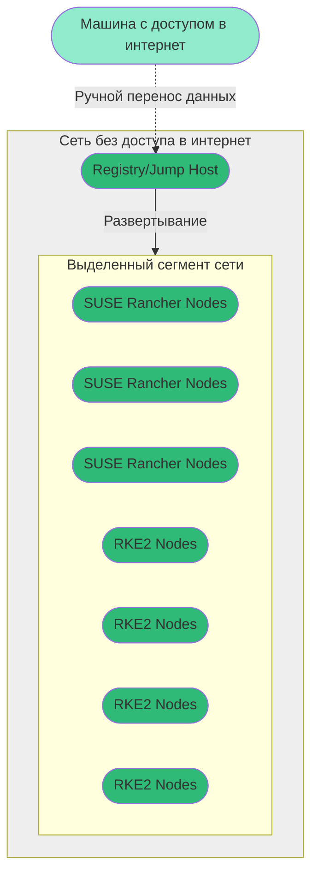

# airgap-10.2022
Материалы к вебинару установки SUSE Rancher Airgap

```mermaid
flowchart TB
style id1 fill:#90EBCD
style id2 fill:#30BA78
style id3 fill:#30BA78
style id31 fill:#30BA78
style id32 fill:#30BA78
style id4 fill:#30BA78
style id41 fill:#30BA78
style id42 fill:#30BA78
style id43 fill:#30BA78
style d10 fill:#EEEEEE

  id1([Машина с доступом в интернет])
  id1 -.Ручной перенос данных.-> id2  
  subgraph d10 ["Сеть без доступа в интернет"]
    direction LR
    id2(["Registry/Jump Host"])
    id2 --> |Развертывание| d30
    subgraph d30 ["Выделенный сегмент сети"]
      direction LR
      id3([SUSE Rancher Nodes])
      id31([SUSE Rancher Nodes])
      id32([SUSE Rancher Nodes])
      id4([RKE2 Nodes])
      id41([RKE2 Nodes])
      id42([RKE2 Nodes])
      id43([RKE2 Nodes])
    end
  end
```

[Файлы материалов](https://github.com/ppzhukov/airgap-10.2022/)

